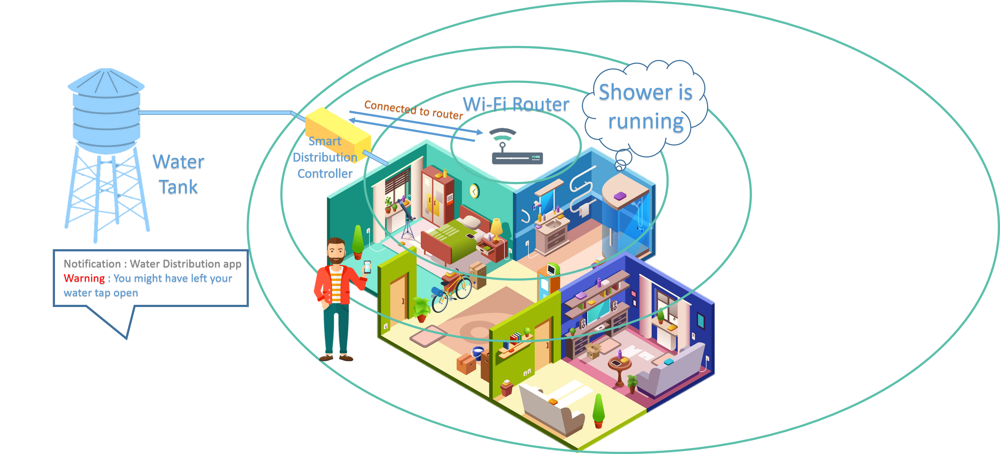

# Smart Water Management System
## By LilHax
### Problem
Global warming being a great issue of this era, requires solutions which help the present generation as well as helps in sustainable development. Human kind has been irresponsible in terms of water usage. We see inappropriate and excessive usage of water especially in Metropolitan cities, where people don’t actually value the natural resource. Our project deals with management of water and water flow from a small society to entire urban infrastructure. 
### Approach
* NodeMCU(ESP8266) is used as an interface to publish the gathered data to the MQTT broker.
* A python script running as a server subscribes to the topics, processes and stores the data in a SQL database.
* Cross platform app subscribes to the appropriate topics and displays the appropriate information to user and admin. 

  
  
